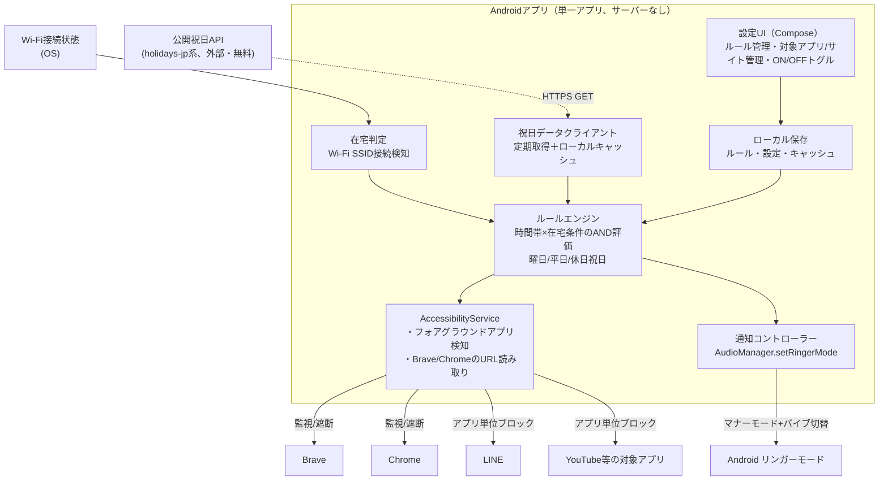

# 要件定義（確定版、2026-06-25）

スマホデトックスを実現するAndroidアプリの要件定義。検討過程の詳細は同フォルダの
`MVPメリデメ比較_ブロック方式.md`、技術方針の詳細は`../02 設計・開発/アーキテクチャ検討.md`を参照。
このドキュメントは確定した要件の最終まとめ。

## 1. 背景・目的

- スマホの使い過ぎを抑止したい
- ショート動画など生産性が低いものへのアクセスを制限したい

## 2. 前提

| 項目 | 内容 |
|---|---|
| 対象プラットフォーム | Androidのみ（iOSは対象外） |
| 配布スコープ | 開発者本人の個人利用のみ（ストア配布なし、サイドロード前提） |
| サーバー構成 | サーバーなし、Androidアプリ単体で完結 |

## 3. 機能要件

### 3.1 在宅時のサイト・アプリブロック

- 自宅にいるときは、指定したサイト・アプリへのアクセスをブロックする。
- **在宅判定**：自宅Wi-FiのSSID接続検知のみで行う（MVP方針。GPS/ジオフェンスは精度・実装コストの比較の結果、今回は実装せず将来の拡張候補とする）。
- **ブロック対象・方式**：
  - サイト：Brave・ChromeのアドレスバーURLを`AccessibilityService`で読み取り、ブロック対象ドメインに該当したら遮断する（ブラウザの種類を問わず効かせるための実現方式。詳細比較は`MVPメリデメ比較_ブロック方式.md`参照）。
  - アプリ：YouTubeアプリ等は`AccessibilityService`によるフォアグラウンドアプリ検知でブロックする。
  - LINEはサイト（URL）単位の制御は行わず、**アプリ単位のブロックのみ**対応する。
- 対象サイト・アプリはアプリ上で指定・管理できる。

### 3.2 ON/OFF切替

- アプリ上でON/OFFを切り替えれば、ブロックする/しないをすぐに切り替えられる（一時的に必要になることがあるため）。
- **解除の摩擦設計：即時切替**（衝動的な解除を防ぐ遅延・確認ステップ等は入れない）。

### 3.3 時間帯指定での利用抑制（追加要求①）

- ご飯中・寝る前など特定の時間帯は、在宅時より広い範囲（LINE・メール等を含む）のアプリ・サイトを制限できる。
- 時間帯は複数設定できる。
- 時間帯指定は曜日・平日／休日・祝日など複数の指定方法に対応する。
- 時間帯ルールは在宅判定と**AND条件**で組み合わせ可能（例：在宅時かつ22時以降のみブロック、のような設定もできる）。
- 祝日判定のため、祝日データは公開APIから自動取得しローカルにキャッシュする（取得失敗時はキャッシュ・同梱フォールバックデータを使用）。

### 3.4 通知の時間帯コントロール（追加要求②）

- 時間帯によって通知を自動でマナーモードに切り替える（例：仕事時間・寝る時間に自動切替）。
- **マナーモードのみ対応**（Android標準のDND/おやすみモードは不要）。
- マナーモード中もバイブレーションは動作させる（サイレントにはしない）。

## 4. 非機能要件・既知の制約

- AccessibilityServiceはAndroid側のバッテリー最適化・未使用アプリの権限自動剥奪等でOSにOFFにされることがある（仕組み自体の制約）。OFFになったら再有効化を促す通知を出す等の緩和策を実装する。
- バックグラウンド処理の安定性のため、バッテリー最適化対象外設定をユーザーに案内する。

## 5. 全体アーキテクチャ

## 6. 確定経緯・参考資料

- ブロック方式の比較検討：`MVPメリデメ比較_ブロック方式.md`
- 技術方針の詳細：`../02 設計・開発/アーキテクチャ検討.md`
- 元の要件メモ（生の検討過程）：`めも.txt`
